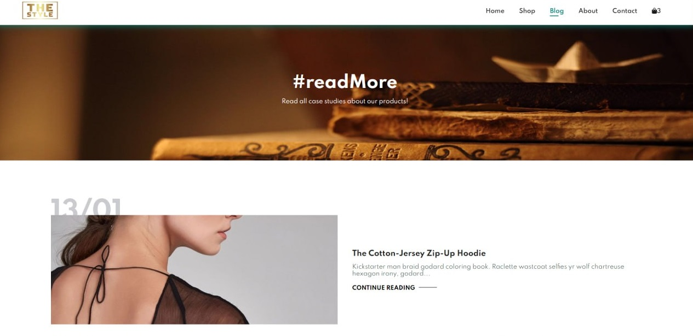
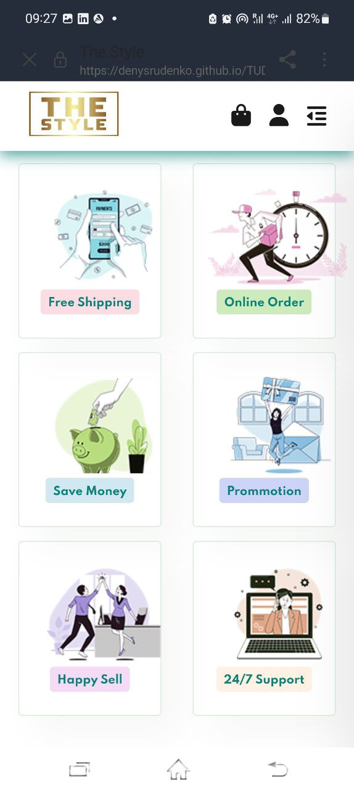

# Welcome to The Style

This website is designed for [The Style](https://denysrudenko.github.io/TUD-Project2_Ecommerce-Shop-Website/).

## Introduction

**The Style** is unfinished store webpage.

Developers create e-commerce websites to provide businesses with an online platform for selling their products or services to a global audience. E-commerce websites offer several advantages over traditional brick-and-mortar stores, such as:

Increased reach: With an e-commerce website, businesses can sell their products or services to customers from all around the world.

Lower costs: E-commerce websites often have lower operating costs than physical stores, such as rent, utilities, and staffing.

Increased convenience: Customers can shop from the comfort of their own homes or on-the-go, and can easily compare prices and products.

Improved customer experience: E-commerce websites can offer a more personalized shopping experience, including product recommendations and tailored promotions.

Better data insights: E-commerce websites provide businesses with valuable data insights, such as customer behavior and preferences, which can inform future marketing and sales strategies.

# 1. Who will be interested in visiting the website?

[Go to the top](#table-of-contents)

- users who wants to check buy clothes

## 1.1 User experience

[Go to the top](#table-of-contents)

Upgrade your wardrobe with our latest fashion arrivals! From trendy tops to stylish dresses, our clothing selection has something for every occasion. Whether you're dressing up for a night out or keeping it casual for the weekend, we have the perfect outfit for you. Our clothes are made with quality materials and designed to flatter your figure, so you can feel confident and comfortable all day long. Don't settle for ordinary clothes - shop with us and elevate your style game! Visit us in-store or shop online now

## 1.2 User Goals

[Go to the top](#table-of-contents)

My main goal during the project was practice.

## 1.3 Site Skeleton

[Go to the top](#table-of-contents)

[Wireframe](https://wireframe.cc/) was used to create wireframes of the website. This was very useful as you can quickly make an example of your website.

## Introduction Page

### Desktop

[Go to the top](#table-of-contents)

- Desktop pages

- Mobile Pages

#### Wireframe:

#### Language:

Website contain 1 language

- English

# 1.4. Technologies Used

[Go to the top](#table-of-contents)

- [HTML5](https://en.wikipedia.org/wiki/HTML5) (markup language) was used for structuring and presenting content of the website.

- [CSS3](https://en.wikipedia.org/wiki/CSS) (Cascading Style Sheets) was used to provide the style to the content written in a HTML.

- [JavaSCript](https://en.wikipedia.org/wiki/JavaScript) JavaScript often abbreviated JS, is a programming language that is one of the core technologies of the World Wide Web, alongside HTML and CSS.

- [Wireframe](https://wireframe.cc/) was used to create wireframes of the website.

- [Google Fonts](https://fonts.google.com/) was used to import font-family 'Krona One' into style,css file and which was used throughout the pages of the website.

- [Font Awesome](https://fontawesome.com/) was used to import icons to the sites.

- [Chrome](https://www.google.com/intl/en_uk/chrome/) was used to debug and test the source code using HTML5 as well as to test site responsiveness.

- [Github](https://github.com/) was used to create the repository and to store the project's code after pushed from Git.

- [Visual Studio](https://code.visualstudio.com/) was used as code generator. I installed ssh for comfortable work.
